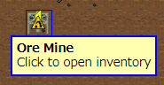
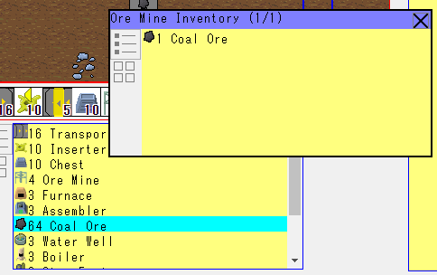
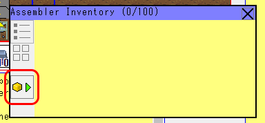
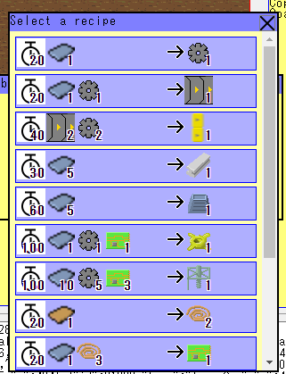
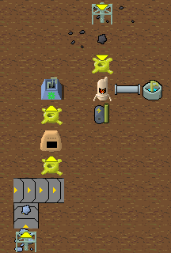

FactorishJS
===========

Factorio-style base building game with HTML5+JavaScript

Try it now!
https://msakuta.github.io/FactorishJS/FactorishJS.html

Features
--------

This project is a demonstration that how plain HTML5 and JavaScript can be used to create a game
with complexity like the great game [Factorio](https://store.steampowered.com/app/427520/Factorio/).

Note that there is a fork of this project called [FactorishWasm](https://github.com/msakuta/FactorishWasm),
which uses HTML canvas and WebAssembly via Rust. It is more easy to develop in larger scale for me, so it has
more features than this one.

How to play
-----------

If you have played Factorio, it should be straightforward.
It is similar to Factorio's god mode, where there is no physical player but you can manipulate buildings directly.

* Cursor

This indicates a tile under the mouse cursor.

* Harvesting

Right clicking on a building or ore harvests it.
If it was an ore deposit, it takes some time to mine an ore.
The progress of mining is shown as a progress bar on top of the cursor.

* Selecting and placing buildings

If you point your mouse cursor on one of the items on the the tool belt, it shows pop-up windows

Clicking on an item on the tool belt selects it. Clicking again will deselect it.

With a tool belt item selected, you can put your mouse cursor on the screen to preview the building to be placed with transparent overlay.

Left-clicking will place the building.

* Directions

Some buildings have directions. It can affect behavior of certain buildings. For example, transport belts carry items towards the direction, an ore miner outputs mined ores to this direction, an inserter picks up item from opposite side of the direction and puts on the indicated side, etc.
You can rotate current direction by hitting R key or clicking the button below.

You can see the current direction on the tool belt.

* Getting/putting items from/to buildings

Some buildings show a tooltip like below. 

You can left-click to open the inventrory window of the building.

You can drag items between the building inventory and player inventory to transport items.
Or, if you use touch pad, you can tap one item and tap an empty space of the other inventry.

* Setting a recipe for an assembler

An assembler has a special button in its inventory window.
This is a button to select a recipe for this assembler.

Clicking on the button shows a new window like this.
Here is a list of recipes that the assembler can use to craft items.
On the left are required items to input, and on the right are the items to output.
Input has time icon , whose number indicates in-game tick count (not seconds).
Clicking one of the items in the list sets the recipe.

Note that you need to put inserters and electricity to make it automated.
You need at least some supply chain like below.

Prerequisites
-------------

This game uses pure JavaScript, no additional plugins are required on your side.
You need a decent browser though.

The game state is saved into your browser, which is entirely in the client side.
If you want to continue playing with a different device, you'll need to serialize the game state
and copy it to another device.

Libraries
---------

This project doesn't depend on an extenal library (yet).
