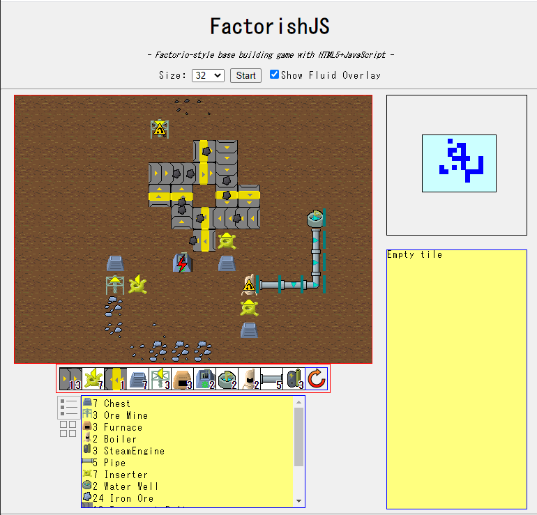
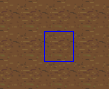
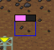
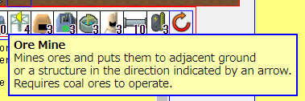
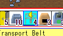
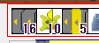
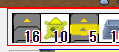

FactorishJS
===========

Factorio-style base building game with HTML5+JavaScript

Try it now!
https://msakuta.github.io/FactorishJS/FactorishJS.html

Features
--------

This project is a demonstration that how plain HTML5 and JavaScript can be used to create a game
with complexity like the great game [Factorio](https://store.steampowered.com/app/427520/Factorio/).

Note that there is a fork of this project called [FactorishWasm](https://github.com/msakuta/FactorishWasm),
which uses HTML canvas and WebAssembly via Rust. It is more easy to develop in larger scale for me, so it has
more features than this one.

How to play
-----------

If you have played Factorio, it should be straightforward.

* Cursor

This indicates a tile under the mouse cursor.

* Harvesting

Right clicking on a building or ore harvests it.
If it was an ore deposit, it takes some time to mine an ore.

* Selecting and placing buildings

If you point your mouse cursor on one of the items on the the tool belt, it shows pop-up windows

Clicking on an item on the tool belt selects it. Clicking again will deselect it.

With a tool belt item selected, you can put your mouse cursor on the screen to preview the building to be placed with transparent overlay.

Left-clicking will place the building.

* Directions

Some buildings have directions. It changes which direction transport belts carry items on them, which way an ore miner outputs mined ores, etc.
You can rotate current direction by hitting R key or clicking the button below.

You can see the current direction on the tool belt.

Prerequisites
-------------

This game uses pure JavaScript, no additional plugins are required on your side.
You need a decent browser though.

The game state is saved into your browser, which is entirely in the client side.
If you want to continue playing with a different device, you'll need to serialize the game state
and copy it to another device.

Libraries
---------

This project doesn't depend on an extenal library (yet).
